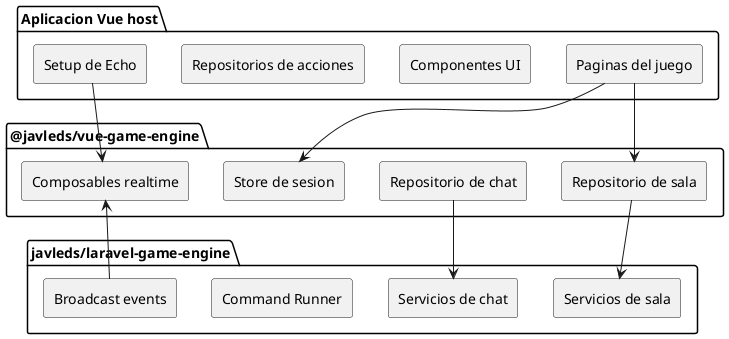

# Vue Game Engine

Paquete frontend reusable para juegos de mesa en linea por turnos usando Vue.

Este paquete contiene la capa cliente generica: repositorios HTTP de sala, repositorios de chat, almacenamiento de sesion del jugador, ciclo de conexion de sala y suscripciones realtime. No renderiza un tablero especifico y no contiene reglas de juego.

La documentacion principal en ingles esta en [README.md](README.md).

## Enlaces de Repositorio

Repositorios oficiales:

- Paquete frontend Vue: https://github.com/javleds/vue-game-engine
- Paquete backend Laravel: https://github.com/javleds/laravel-game-engine

## Relacion Backend / Frontend

`@javleds/vue-game-engine` es la mitad frontend del motor. `javleds/laravel-game-engine` es la mitad backend. El frontend consume endpoints HTTP, guarda la sesion local del jugador y escucha eventos realtime por sala. El backend mantiene el estado autoritativo.



## Que Resuelve

El paquete frontend resuelve:

- Llamadas HTTP genericas para crear, unir, salir, iniciar, desconectar y consultar estado de sala.
- Llamadas HTTP genericas para listar y enviar mensajes de chat.
- Helper de bearer token para requests por jugador.
- Store Pinia para datos de reconexion.
- Suscripciones realtime por sala para cambios de estado y chat.
- Composable de ciclo de conexion/desconexion.
- Componentes Vue reutilizables para resumen de sala, jugadores del lobby, chat, orden de turnos, contenedores de cartas, galerias y modales.
- Tipos TypeScript compartidos para sala y chat.

La aplicacion host sigue siendo responsable de:

- Paginas y componentes Vue.
- Repositorios de acciones especificas del juego.
- Tipos TypeScript del estado y comandos del juego.
- Configurar Laravel Echo u otro cliente realtime compatible.
- Estilos, rutas y comportamiento de UI.

## Componentes Reutilizables

El paquete exporta componentes Vue reutilizables agregados despues de `07a3a37` / tag `0.1.4`. Proveen UI estructural para pantallas comunes de juegos por turnos sin contener reglas ni estado especifico del juego.

Instala los estilos estructurales del paquete una vez durante el arranque de la app:

```ts
import { installTurnEngineComponentStyles } from '@javleds/vue-game-engine'

installTurnEngineComponentStyles()
```

Referencia de componentes:

- [Indice de componentes](docs/components/README.md)
- [EngineActionDialog](docs/components/EngineActionDialog.md)
- [EngineCardShell](docs/components/EngineCardShell.md)
- [EngineCardStack](docs/components/EngineCardStack.md)
- [EngineChatForm](docs/components/EngineChatForm.md)
- [EngineChatMessages](docs/components/EngineChatMessages.md)
- [EngineDeckCard](docs/components/EngineDeckCard.md)
- [EngineFloatingChat](docs/components/EngineFloatingChat.md)
- [EngineGalleryOverlay](docs/components/EngineGalleryOverlay.md)
- [EngineHelpButton](docs/components/EngineHelpButton.md)
- [EngineHelpModal](docs/components/EngineHelpModal.md)
- [EngineLobbyChat](docs/components/EngineLobbyChat.md)
- [EngineLobbyPlayerList](docs/components/EngineLobbyPlayerList.md)
- [EnginePlayerStatusPanel](docs/components/EnginePlayerStatusPanel.md)
- [EngineRoomSummary](docs/components/EngineRoomSummary.md)
- [EngineTabs](docs/components/EngineTabs.md)
- [EngineTurnOrder](docs/components/EngineTurnOrder.md)

## Instalacion Local

Para desarrollo con repos hermanos:

```json
{
  "dependencies": {
    "@javleds/vue-game-engine": "file:../vue-game-engine"
  }
}
```

Despues:

```bash
npm install
```

Cuando el paquete este publicado en npm, se podra reemplazar el `file:` por una version semantica.

## Setup en la App Host

Configura el cliente realtime durante el arranque de la app. Laravel Echo es el cliente esperado por defecto:

```ts
import Echo from 'laravel-echo'
import Pusher from 'pusher-js'
import { configureTurnEngineRealtime } from '@javleds/vue-game-engine'

window.Pusher = Pusher

const echo = new Echo({
  broadcaster: 'reverb',
  key: import.meta.env.VITE_REVERB_APP_KEY,
  wsHost: import.meta.env.VITE_REVERB_HOST,
  wsPort: Number(import.meta.env.VITE_REVERB_PORT ?? 80),
  wssPort: Number(import.meta.env.VITE_REVERB_PORT ?? 443),
  forceTLS: (import.meta.env.VITE_REVERB_SCHEME ?? 'https') === 'https',
  enabledTransports: ['ws', 'wss'],
  authEndpoint: '/broadcasting/auth',
})

configureTurnEngineRealtime(echo)
```

Importa ese modulo antes de montar Vue:

```ts
import './echo'
```

Cuando uses paquetes locales enlazados, conserva symlinks para que TypeScript y Vite resuelvan las peer dependencies desde la app host:

```json
{
  "compilerOptions": {
    "preserveSymlinks": true
  }
}
```

```ts
export default defineConfig({
  resolve: {
    preserveSymlinks: true,
  },
})
```

## Contrato Backend / Frontend

El paquete espera endpoints compatibles con estos flujos:

- Ciclo de sala: crear, unir, salir, iniciar, desconectar, reconectar/consultar estado.
- Chat: listar mensajes y enviar mensaje.
- Eventos realtime en canales `room.{roomId}`:
  - `.room.state.changed`
  - `.room.chat.message.created`

Los comandos especificos del juego quedan fuera del paquete. La app host debe crear su propio repositorio de acciones y puede reutilizar el cliente `http` y el helper `bearer` exportados.

## Checklist Para Publicar

- Mantener `dist` generado por `npm run build` antes de publicar.
- Agregar CI para typecheck, build e instalacion de prueba.
- Crear tag semantico, por ejemplo `v0.1.0`.

## Build

Este paquete publica JavaScript compilado y declaraciones desde `dist`.

```bash
npm install
npm run build
npm pack --dry-run
```
