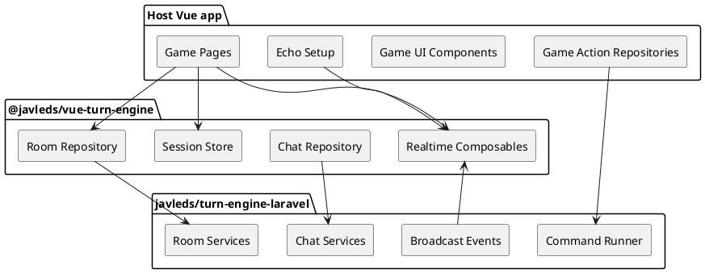

# Vue Game Engine

Reusable Vue client package for online turn-based board games.

This package owns the generic frontend client layer: room HTTP repositories, chat repositories, player session storage, room connection lifecycle, and realtime subscriptions. It does not render a specific game board and does not contain game rules.

Spanish documentation is available in [README.es.md](README.es.md).

## Repository Links

Official repository links will be added here before publishing:

- Vue frontend package: TODO
- Laravel backend package: TODO
- Example host game: TODO

## Package Pair

This package is the frontend half of the engine. It is designed to work with the Laravel backend package, `javleds/turn-engine-laravel`, through HTTP endpoints and realtime room events.



## Responsibilities

The package provides:

- Generic room HTTP calls: create, join, leave, start, disconnect, and fetch state.
- Generic chat HTTP calls: list and send room messages.
- Bearer-token helper for room-scoped requests.
- Pinia session store for player reconnect data.
- Realtime room subscriptions for state and chat events.
- Connection lifecycle composable for disconnect keepalive behavior.
- Shared TypeScript types for room and chat API responses.

The host game provides:

- Vue pages and components.
- Game-specific action repositories.
- Game-specific TypeScript state and command payload types.
- Laravel Echo or another compatible realtime client.
- Styling, routing, and UI behavior.

## Installation

For local development with a sibling checkout:

```json
{
  "dependencies": {
    "@javleds/vue-turn-engine": "file:../vue-game-engine"
  }
}
```

Then run:

```bash
npm install
```

For npm registry usage, replace the file dependency with the published package version once the repository is published.

## Host App Setup

Configure the realtime client during app boot. Laravel Echo is the expected default client:

```ts
import Echo from 'laravel-echo'
import Pusher from 'pusher-js'
import { configureTurnEngineRealtime } from '@javleds/vue-turn-engine'

window.Pusher = Pusher

const echo = new Echo({
  broadcaster: 'reverb',
  key: import.meta.env.VITE_REVERB_APP_KEY,
  wsHost: import.meta.env.VITE_REVERB_HOST,
  wsPort: Number(import.meta.env.VITE_REVERB_PORT ?? 80),
  wssPort: Number(import.meta.env.VITE_REVERB_PORT ?? 443),
  forceTLS: (import.meta.env.VITE_REVERB_SCHEME ?? 'https') === 'https',
  enabledTransports: ['ws', 'wss'],
  authEndpoint: '/broadcasting/auth',
})

configureTurnEngineRealtime(echo)
```

Import that setup module before mounting Vue.

```ts
import './echo'
```

When using local linked packages, preserve symlinks so TypeScript and Vite resolve peer dependencies from the host app:

```json
{
  "compilerOptions": {
    "preserveSymlinks": true
  }
}
```

```ts
export default defineConfig({
  resolve: {
    preserveSymlinks: true,
  },
})
```

## Backend / Frontend Contract

The package expects host endpoints compatible with these flows:

- Room lifecycle: create, join, leave, start, disconnect, reconnect/state fetch.
- Chat lifecycle: list messages and send message.
- Realtime events on `room.{roomId}` channels:
  - `.room.state.changed`
  - `.room.chat.message.created`

Game-specific commands are intentionally outside this package. A game app should create its own action repository and can reuse the exported `http` client and `bearer` helper.

## Publishing Checklist

Before publishing this package publicly:

- Add official repository URLs in this README and `package.json`.
- Confirm the official repository URL before publishing.
-  Keep `dist` generated by `npm run build` before publishing.
- Add CI for typecheck, package build, and install smoke tests.
- Tag a semantic version, for example `v0.1.0`.

## Current Status

This package is extracted and usable as a local npm file package. It is not tied to the Giants game domain.

## Build

This package publishes compiled JavaScript and declaration files from `dist`.

```bash
npm install
npm run build
npm pack --dry-run
```
