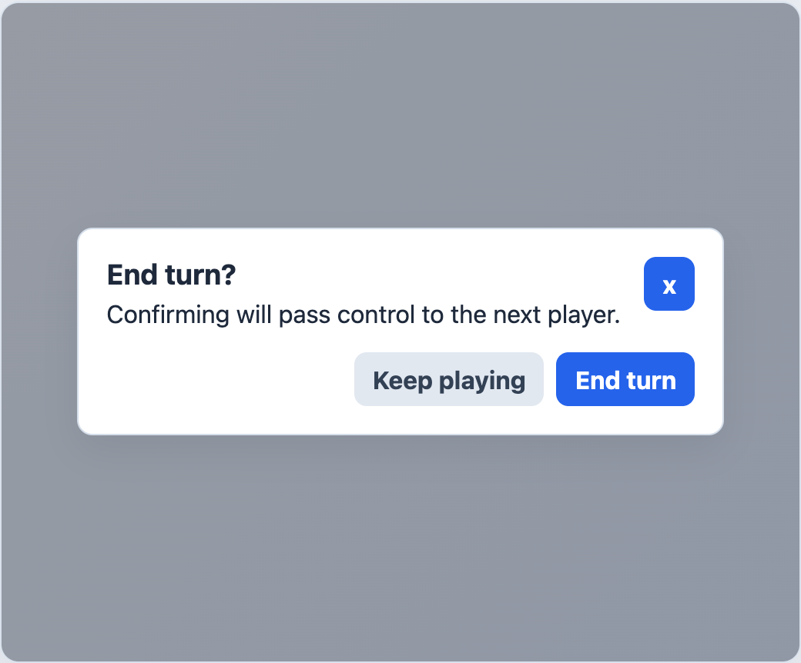

# EngineActionDialog



## English

Confirmation dialog for game actions. It focuses the dialog when opened, cancels with `Escape`, and confirms with `Enter` or space.

### Props

| Prop | Type | Default |
| --- | --- | --- |
| `open` | `boolean` | required |
| `title` | `string` | required |
| `body` | `string` | `''` |
| `ariaLabel` | `string` | `''` |
| `cancelLabel` | `string` | `'Cancelar'` |
| `confirmLabel` | `string` | `'Confirmar'` |
| `confirmDisabled` | `boolean` | `false` |
| `cancelDisabled` | `boolean` | `false` |
| `closeLabel` | `string` | `'Cerrar'` |
| `showClose` | `boolean` | `false` |
| `showDefaultActions` | `boolean` | `true` |

### Events

| Event | Payload |
| --- | --- |
| `cancel` | none |
| `confirm` | none |

### Slots

| Slot | Purpose |
| --- | --- |
| default | Dialog body content. |
| `actions` | Replaces the default cancel and confirm buttons. |
| `close` | Replaces the default close glyph. |

```vue
<EngineActionDialog
  :open="confirming"
  title="End turn?"
  body="This action cannot be changed after it is confirmed."
  confirm-label="End turn"
  @cancel="confirming = false"
  @confirm="endTurn"
/>
```

## Espanol

Dialogo de confirmacion para acciones del juego. Enfoca el dialogo al abrirse, cancela con `Escape` y confirma con `Enter` o espacio.

## Screenshot Code / Codigo de la Captura

```vue
<script setup lang="ts">
import { EngineActionDialog, installTurnEngineComponentStyles } from '@javleds/vue-game-engine'

installTurnEngineComponentStyles()
</script>

<template>
  <section class="shot">
    <EngineActionDialog
      open
      title="End turn?"
      body="Confirming will pass control to the next player."
      confirm-label="End turn"
      cancel-label="Keep playing"
      show-close
    />
  </section>
</template>

<style scoped>
.shot {
  position: relative;
  width: 520px;
  height: 430px;
  overflow: hidden;
  border-radius: 12px;
  background: #eef2f7;
}

:global(.te-action-dialog-backdrop) {
  position: absolute;
  background: rgb(15 23 42 / 42%);
}

:global(.te-action-dialog) {
  border: 1px solid #d4deea;
  border-radius: 10px;
  background: white;
  padding: 18px;
  box-shadow: 0 10px 25px rgb(15 23 42 / 8%);
}

:global(.te-action-dialog__cancel),
:global(.te-action-dialog__close) {
  background: #e2e8f0;
  color: #334155;
}
</style>
```
