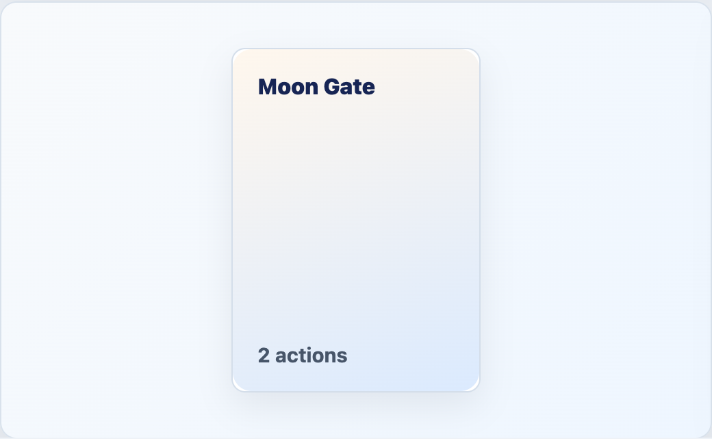

# EngineCardShell



## English

Accessible wrapper for a game card. When `inspectable` is enabled it behaves like a button and emits `inspect` on click, `Enter`, or space.

### Props

| Prop | Type | Default |
| --- | --- | --- |
| `inspectable` | `boolean` | `false` |
| `disabled` | `boolean` | `false` |

### Events

| Event | Payload |
| --- | --- |
| `inspect` | none |

### Slots

| Slot | Purpose |
| --- | --- |
| default | Card content rendered by the host game. |

```vue
<EngineCardShell inspectable @inspect="selectedCard = card">
  <GameCardFace :card="card" />
</EngineCardShell>
```

## Espanol

Contenedor accesible para una carta del juego. Cuando `inspectable` esta activo se comporta como boton y emite `inspect` con click, `Enter` o espacio.

## Screenshot Code / Codigo de la Captura

```vue
<script setup lang="ts">
import { EngineCardShell, installTurnEngineComponentStyles } from '@javleds/vue-game-engine'

installTurnEngineComponentStyles()

function inspectCard(): void {
  console.log('Inspect Moon Gate')
}
</script>

<template>
  <section class="shot">
    <EngineCardShell inspectable @inspect="inspectCard">
      <div class="sample-card">
        <strong>Moon Gate</strong>
        <span>2 actions</span>
      </div>
    </EngineCardShell>
  </section>
</template>

<style scoped>
.shot {
  display: grid;
  place-items: center;
  width: 520px;
  min-height: 320px;
  border-radius: 12px;
  background: #eef6ff;
}

:global(.te-card-shell) {
  border: 1px solid #d4deea;
  border-radius: 10px;
  background: white;
  box-shadow: 0 10px 25px rgb(15 23 42 / 8%);
}

.sample-card {
  display: grid;
  align-content: space-between;
  width: 180px;
  height: 250px;
  padding: 18px;
  border-radius: 14px;
  background: linear-gradient(160deg, #fff7ed 0%, #dbeafe 100%);
  color: #172554;
  font-weight: 800;
}

.sample-card span {
  color: #475569;
}
</style>
```
