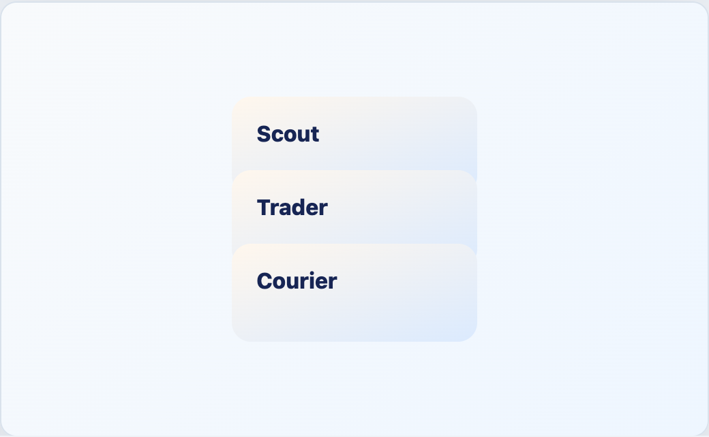

# EngineCardStack



## English

Simple structural container for a vertical stack of cards.

### Slots

| Slot | Purpose |
| --- | --- |
| default | Cards or other stack items. |

```vue
<EngineCardStack>
  <EngineDeckCard label="A" />
  <EngineDeckCard label="B" />
</EngineCardStack>
```

## Espanol

Contenedor estructural simple para una pila vertical de cartas.

## Screenshot Code / Codigo de la Captura

```vue
<script setup lang="ts">
import { EngineCardStack, installTurnEngineComponentStyles } from '@javleds/vue-game-engine'

installTurnEngineComponentStyles()
</script>

<template>
  <section class="shot">
    <EngineCardStack>
      <div class="sample-card stacked">Scout</div>
      <div class="sample-card stacked">Trader</div>
      <div class="sample-card stacked">Courier</div>
    </EngineCardStack>
  </section>
</template>

<style scoped>
.shot {
  display: grid;
  place-items: center;
  width: 520px;
  min-height: 320px;
  border-radius: 12px;
  background: #eef6ff;
}

.sample-card {
  display: grid;
  align-content: center;
  width: 180px;
  height: 72px;
  padding: 18px;
  border: 1px solid #d4deea;
  border-radius: 14px;
  background: linear-gradient(160deg, #fff7ed 0%, #dbeafe 100%);
  color: #172554;
  font-weight: 800;
  box-shadow: 0 10px 25px rgb(15 23 42 / 8%);
}

.stacked {
  margin-top: -18px;
}

.stacked:first-child {
  margin-top: 0;
}
</style>
```
