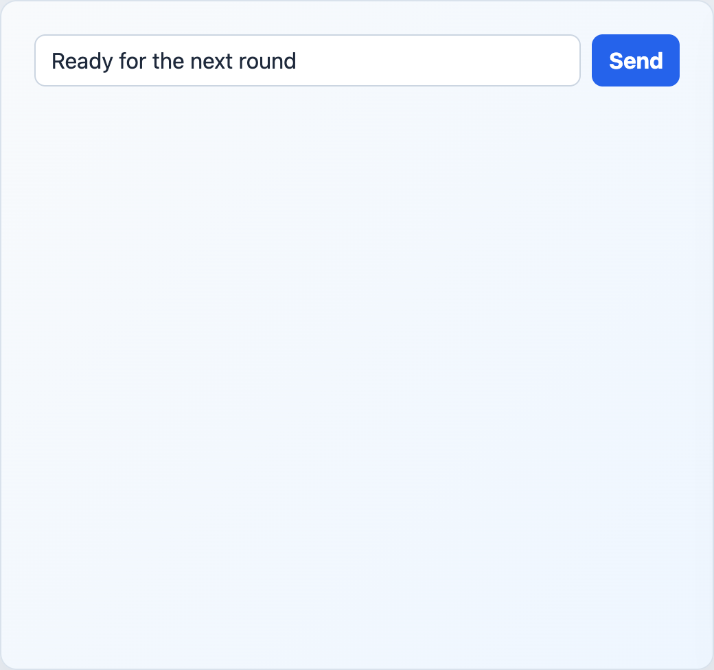

# EngineChatForm



## English

Controlled chat input. The host owns the draft value and decides how to send messages.

### Props

| Prop | Type | Default |
| --- | --- | --- |
| `draft` | `string` | required |
| `maxLength` | `number` | `1000` |
| `submitLabel` | `string` | `'Enviar'` |
| `disabled` | `boolean` | `false` |

### Events

| Event | Payload |
| --- | --- |
| `update:draft` | `string` |
| `submit` | none |

```vue
<EngineChatForm v-model:draft="draft" submit-label="Send" @submit="sendMessage" />
```

## Espanol

Input controlado para chat. La app host conserva el borrador y decide como enviar los mensajes.

## Screenshot Code / Codigo de la Captura

```vue
<script setup lang="ts">
import { ref } from 'vue'
import { EngineChatForm, installTurnEngineComponentStyles } from '@javleds/vue-game-engine'

installTurnEngineComponentStyles()

const draft = ref('Ready for the next round')
</script>

<template>
  <section class="shot">
    <EngineChatForm v-model:draft="draft" submit-label="Send" />
  </section>
</template>

<style scoped>
.shot {
  width: 520px;
  min-height: 150px;
  padding: 24px;
  border-radius: 12px;
  background: #eef6ff;
}

:global(.te-chat-form__input) {
  border: 1px solid #cbd5e1;
  border-radius: 8px;
  color: #1e293b;
  padding: 0.55rem 0.7rem;
}

:global(.te-chat-form button) {
  border: 0;
  border-radius: 8px;
  background: #2563eb;
  color: white;
  font-weight: 700;
  padding: 0.55rem 0.75rem;
}
</style>
```
