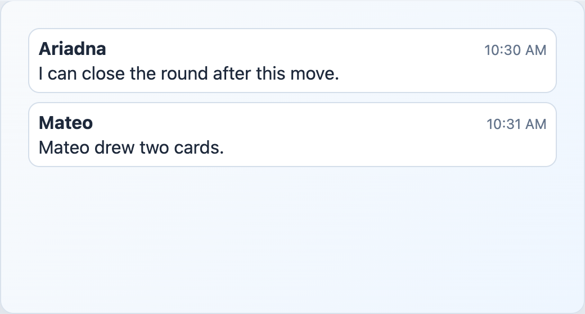

# EngineChatMessages



## English

Scrollable message list for `ChatMessageView[]`. It auto-scrolls when `messages` or `autoScrollKey` changes and exposes `scrollToBottom()`.

### Props

| Prop | Type | Default |
| --- | --- | --- |
| `messages` | `ChatMessageView[]` | required |
| `autoScrollKey` | `string \| number \| boolean` | `''` |

### Slots

| Slot | Purpose |
| --- | --- |
| `message` | Custom body for each message. Receives `{ message }`. |

```vue
<EngineChatMessages :messages="messages">
  <template #message="{ message }">
    <p>{{ message.kind === 'activity' ? `* ${message.message}` : message.message }}</p>
  </template>
</EngineChatMessages>
```

## Espanol

Lista desplazable para `ChatMessageView[]`. Hace auto-scroll cuando cambian `messages` o `autoScrollKey` y expone `scrollToBottom()`.

## Screenshot Code / Codigo de la Captura

```vue
<script setup lang="ts">
import { EngineChatMessages, installTurnEngineComponentStyles, type ChatMessageView } from '@javleds/vue-game-engine'

installTurnEngineComponentStyles()

const messages: ChatMessageView[] = [
  {
    id: 'm1',
    roomId: 'R-204',
    playerId: 'p1',
    nickname: 'Ariadna',
    kind: 'chat',
    message: 'I can close the round after this move.',
    createdAt: '2026-06-21T16:30:00Z',
  },
  {
    id: 'm2',
    roomId: 'R-204',
    playerId: 'p2',
    nickname: 'Mateo',
    kind: 'activity',
    message: 'Mateo drew two cards.',
    createdAt: '2026-06-21T16:31:00Z',
  },
]
</script>

<template>
  <section class="shot">
    <EngineChatMessages :messages="messages" />
  </section>
</template>

<style scoped>
.shot {
  width: 520px;
  min-height: 280px;
  padding: 24px;
  border-radius: 12px;
  background: #eef6ff;
}

:global(.te-chat-messages) {
  max-height: 210px;
}

:global(.te-chat-message) {
  border: 1px solid #d4deea;
  border-radius: 10px;
  background: white;
}

:global(.te-chat-message__time) {
  color: #64748b;
  font-size: 0.78rem;
}
</style>
```
