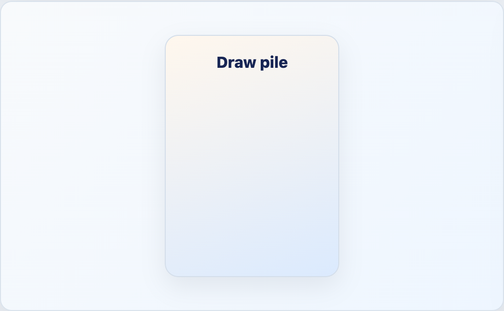

# EngineDeckCard



## English

Minimal deck/card placeholder. Use it for draw piles, hidden cards, counters, or simple card labels.

### Props

| Prop | Type | Default |
| --- | --- | --- |
| `label` | `string` | required |

### Slots

| Slot | Purpose |
| --- | --- |
| default | Overrides the text label. |

```vue
<EngineDeckCard label="Draw pile" />
```

## Espanol

Placeholder minimo para mazos o cartas. Sirve para pilas de robo, cartas ocultas, contadores o etiquetas simples.

## Screenshot Code / Codigo de la Captura

```vue
<script setup lang="ts">
import { EngineDeckCard, installTurnEngineComponentStyles } from '@javleds/vue-game-engine'

installTurnEngineComponentStyles()
</script>

<template>
  <section class="shot">
    <EngineDeckCard label="Draw pile" />
  </section>
</template>

<style scoped>
.shot {
  display: grid;
  place-items: center;
  width: 520px;
  min-height: 320px;
  border-radius: 12px;
  background: #eef6ff;
}

:global(.te-deck-card) {
  place-items: center;
  width: 180px;
  height: 250px;
  padding: 18px;
  border: 1px solid #d4deea;
  border-radius: 14px;
  background: linear-gradient(160deg, #fff7ed 0%, #dbeafe 100%);
  color: #172554;
  font-weight: 800;
  box-shadow: 0 10px 25px rgb(15 23 42 / 8%);
}
</style>
```
