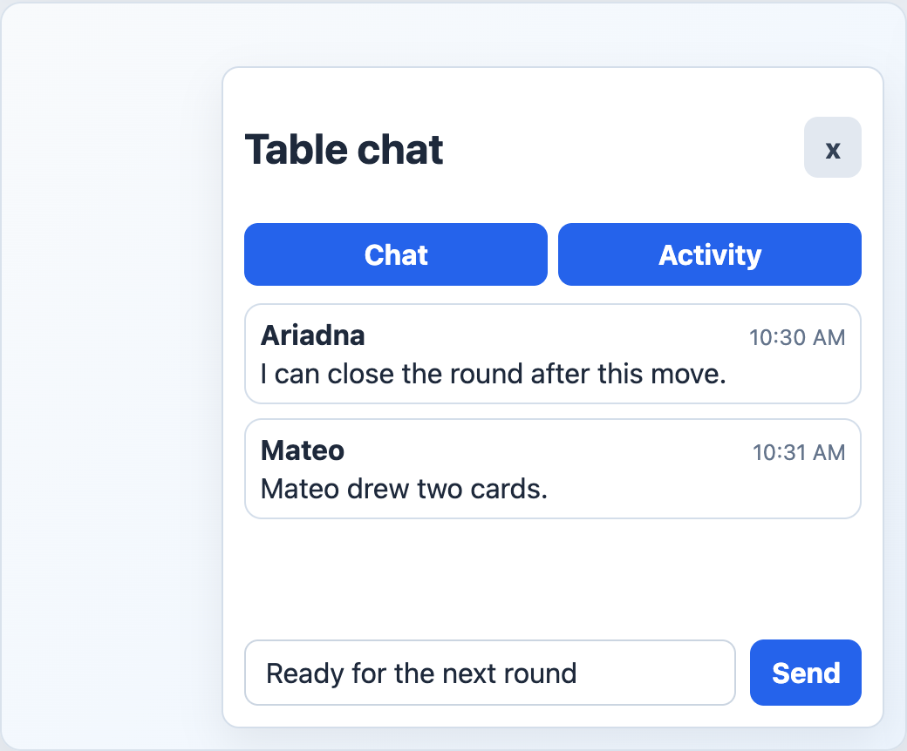

# EngineFloatingChat



## English

Floating in-game chat with chat and activity tabs. The host controls open state, draft state, active tab, and message sending.

### Props

| Prop | Type | Default |
| --- | --- | --- |
| `open` | `boolean` | required |
| `chatMessages` | `ChatMessageView[]` | required |
| `activityMessages` | `ChatMessageView[]` | `[]` |
| `draft` | `string` | required |
| `activeTab` | `EngineChatTab` | `'chat'` |
| `unread` | `boolean` | `false` |
| `title` | `string` | `'Chat'` |
| `chatLabel` | `string` | `'Chat'` |
| `activityLabel` | `string` | `'Movimientos'` |
| `openLabel` | `string` | `'Chat'` |
| `closeLabel` | `string` | `'Cerrar chat'` |
| `sendLabel` | `string` | `'Enviar'` |

### Events

| Event | Payload |
| --- | --- |
| `update:open` | `boolean` |
| `update:draft` | `string` |
| `update:activeTab` | `EngineChatTab` |
| `send` | none |

### Slots

| Slot | Purpose |
| --- | --- |
| `message` | Custom message body. Receives `{ message }`. |
| `close` | Replaces the close glyph. |

```vue
<EngineFloatingChat
  v-model:open="chatOpen"
  v-model:draft="draft"
  v-model:active-tab="activeChatTab"
  :chat-messages="chatMessages"
  :activity-messages="activityMessages"
  :unread="hasUnreadMessages"
  @send="sendMessage"
/>
```

## Espanol

Chat flotante dentro del juego con tabs de chat y actividad. La app host controla apertura, borrador, tab activo y envio.

## Screenshot Code / Codigo de la Captura

```vue
<script setup lang="ts">
import { ref } from 'vue'
import {
  EngineFloatingChat,
  installTurnEngineComponentStyles,
  type ChatMessageView,
  type EngineChatTab,
} from '@javleds/vue-game-engine'

installTurnEngineComponentStyles()

const chatOpen = ref(true)
const chatTab = ref<EngineChatTab>('chat')
const draft = ref('Ready for the next round')

const messages: ChatMessageView[] = [
  {
    id: 'm1',
    roomId: 'R-204',
    playerId: 'p1',
    nickname: 'Ariadna',
    kind: 'chat',
    message: 'I can close the round after this move.',
    createdAt: '2026-06-21T16:30:00Z',
  },
  {
    id: 'm2',
    roomId: 'R-204',
    playerId: 'p2',
    nickname: 'Mateo',
    kind: 'activity',
    message: 'Mateo drew two cards.',
    createdAt: '2026-06-21T16:31:00Z',
  },
]
</script>

<template>
  <section class="shot">
    <EngineFloatingChat
      v-model:open="chatOpen"
      v-model:draft="draft"
      v-model:active-tab="chatTab"
      :chat-messages="messages"
      :activity-messages="messages"
      title="Table chat"
      activity-label="Activity"
      send-label="Send"
    />
  </section>
</template>

<style scoped>
.shot {
  position: relative;
  width: 520px;
  height: 430px;
  overflow: hidden;
  border-radius: 12px;
  background: #eef6ff;
}

:global(.te-chat-panel) {
  position: absolute;
  right: 24px;
  bottom: 24px;
  border: 1px solid #d4deea;
  border-radius: 10px;
  background: white;
  box-shadow: 0 10px 25px rgb(15 23 42 / 8%);
}

:global(.te-chat-message) {
  border: 1px solid #d4deea;
  border-radius: 10px;
  background: white;
}

:global(.te-chat-panel__close) {
  background: #e2e8f0;
  color: #334155;
}
</style>
```
