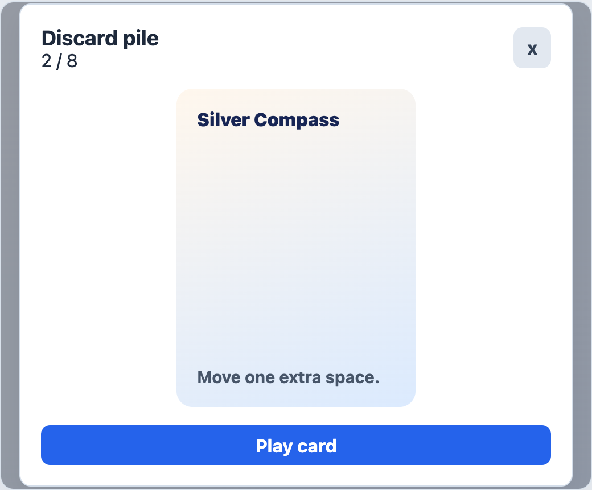

# EngineGalleryOverlay



## English

Modal overlay for inspecting a gallery of cards or item stacks. Keyboard controls emit navigation events instead of owning item state.

### Props

| Prop | Type | Default |
| --- | --- | --- |
| `open` | `boolean` | required |
| `title` | `string` | required |
| `positionText` | `string` | `''` |
| `ariaLabel` | `string` | `'Galeria'` |
| `closeLabel` | `string` | `'Salir de galeria'` |
| `actionLabel` | `string` | `''` |
| `actionTitle` | `string` | `''` |
| `actionDisabled` | `boolean` | `false` |
| `showAction` | `boolean` | `false` |

### Events

| Event | Trigger |
| --- | --- |
| `close` | Backdrop click or `Escape`. |
| `previousItem` | Left arrow, `A`, or horizontal swipe right. |
| `nextItem` | Right arrow, `D`, or horizontal swipe left. |
| `previousStack` | Up arrow, `W`, or swipe down. |
| `nextStack` | Down arrow, `S`, or swipe up. |
| `activate` | Action button, `Enter`, or space. |

### Slots

| Slot | Purpose |
| --- | --- |
| default | Current gallery item. |
| `footer` | Extra metadata or controls. |
| `close` | Replaces the close glyph. |

```vue
<EngineGalleryOverlay
  :open="galleryOpen"
  title="Discard pile"
  :position-text="`${currentIndex + 1} / ${cards.length}`"
  show-action
  action-label="Play card"
  @close="galleryOpen = false"
  @next-item="nextCard"
  @previous-item="previousCard"
  @activate="playCurrentCard"
>
  <GameCardFace :card="currentCard" />
</EngineGalleryOverlay>
```

## Espanol

Overlay modal para inspeccionar una galeria de cartas o pilas de items. Los controles de teclado emiten eventos de navegacion; el estado queda en la app host.

## Screenshot Code / Codigo de la Captura

```vue
<script setup lang="ts">
import { ref } from 'vue'
import { EngineGalleryOverlay, installTurnEngineComponentStyles } from '@javleds/vue-game-engine'

installTurnEngineComponentStyles()

const galleryOpen = ref(true)
</script>

<template>
  <section class="shot">
    <EngineGalleryOverlay
      :open="galleryOpen"
      title="Discard pile"
      position-text="2 / 8"
      show-action
      action-label="Play card"
      action-title="Play selected card"
      @close="galleryOpen = false"
    >
      <div class="sample-card">
        <strong>Silver Compass</strong>
        <span>Move one extra space.</span>
      </div>
    </EngineGalleryOverlay>
  </section>
</template>

<style scoped>
.shot {
  position: relative;
  width: 520px;
  height: 430px;
  overflow: hidden;
  border-radius: 12px;
  background: #eef2f7;
}

:global(.te-gallery-backdrop) {
  position: absolute;
  background: rgb(15 23 42 / 42%);
}

:global(.te-gallery-dialog) {
  border: 1px solid #d4deea;
  border-radius: 10px;
  background: white;
  padding: 18px;
}

.sample-card {
  display: grid;
  align-content: space-between;
  width: 210px;
  height: 280px;
  padding: 18px;
  border-radius: 14px;
  background: linear-gradient(160deg, #fff7ed 0%, #dbeafe 100%);
  color: #172554;
  font-weight: 800;
}

:global(.te-gallery-action) {
  width: 100%;
}
</style>
```
