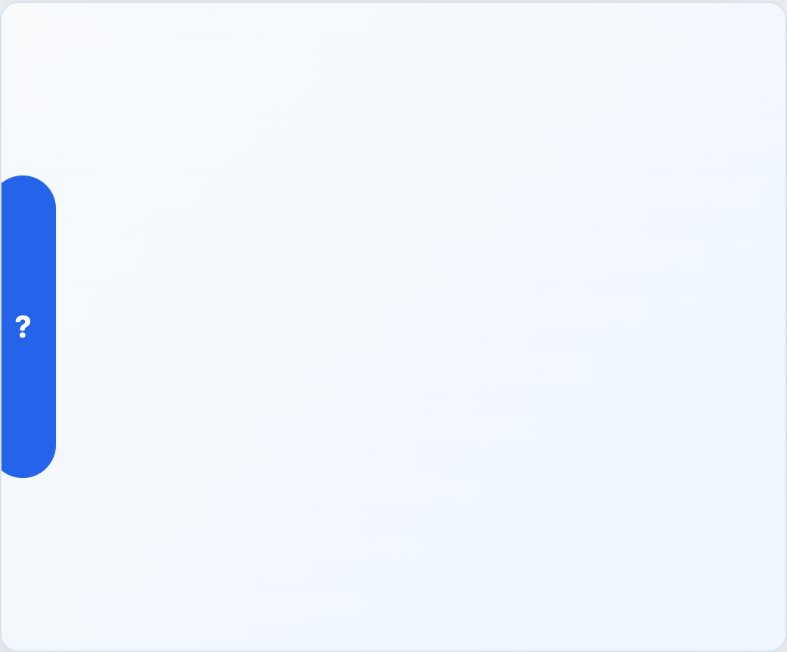

# EngineHelpButton



## English

Floating help button. Pair it with `EngineHelpModal` or a host-owned help panel.

### Props

| Prop | Type | Default |
| --- | --- | --- |
| `label` | `string` | `'Abrir ayuda'` |

### Events

| Event | Payload |
| --- | --- |
| `open` | none |

### Slots

| Slot | Purpose |
| --- | --- |
| default | Button content. Defaults to `?`. |

```vue
<EngineHelpButton label="Open help" @open="helpOpen = true" />
```

## Espanol

Boton flotante de ayuda. Usalo junto con `EngineHelpModal` o con un panel propio de la app host.

## Screenshot Code / Codigo de la Captura

```vue
<script setup lang="ts">
import { EngineHelpButton, installTurnEngineComponentStyles } from '@javleds/vue-game-engine'

installTurnEngineComponentStyles()

function openHelp(): void {
  console.log('Open help')
}
</script>

<template>
  <section class="shot">
    <EngineHelpButton label="Open help" @open="openHelp" />
  </section>
</template>

<style scoped>
.shot {
  position: relative;
  width: 520px;
  min-height: 150px;
  overflow: hidden;
  border-radius: 12px;
  background: #eef6ff;
}

:global(.te-help-fab) {
  position: absolute;
  left: 50%;
  top: 50%;
  bottom: auto;
  transform: translate(-50%, -50%);
  border: 0;
  border-radius: 999px;
  background: #2563eb;
  color: white;
  font-size: 1.25rem;
  font-weight: 700;
}
</style>
```
