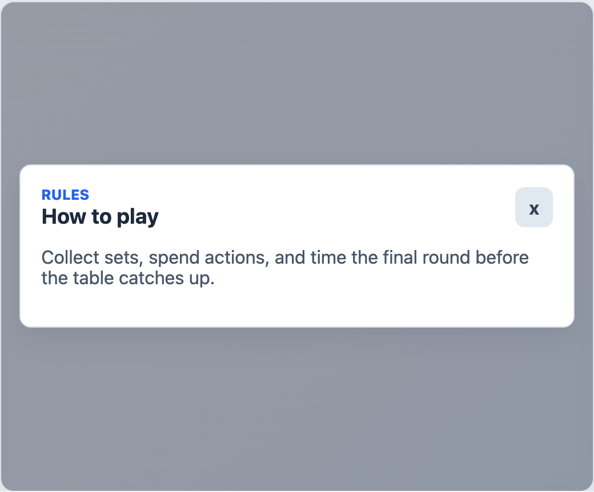

# EngineHelpModal



## English

Modal shell for game rules, controls, or contextual help. The host owns the content.

### Props

| Prop | Type | Default |
| --- | --- | --- |
| `open` | `boolean` | required |
| `title` | `string` | `'Ayuda'` |
| `eyebrow` | `string` | `''` |
| `closeLabel` | `string` | `'Cerrar ayuda'` |

### Events

| Event | Payload |
| --- | --- |
| `update:open` | `boolean` |
| `close` | none |

### Slots

| Slot | Purpose |
| --- | --- |
| default | Help content. |
| `close` | Replaces the close glyph. |

```vue
<EngineHelpModal v-model:open="helpOpen" title="How to play" eyebrow="Rules">
  <p>Collect sets, spend actions, and end the round before your rivals.</p>
</EngineHelpModal>
```

## Espanol

Contenedor modal para reglas, controles o ayuda contextual. La app host define el contenido.

## Screenshot Code / Codigo de la Captura

```vue
<script setup lang="ts">
import { ref } from 'vue'
import { EngineHelpModal, installTurnEngineComponentStyles } from '@javleds/vue-game-engine'

installTurnEngineComponentStyles()

const helpOpen = ref(true)
</script>

<template>
  <section class="shot">
    <EngineHelpModal v-model:open="helpOpen" title="How to play" eyebrow="Rules">
      <p>Collect sets, spend actions, and time the final round before the table catches up.</p>
    </EngineHelpModal>
  </section>
</template>

<style scoped>
.shot {
  position: relative;
  width: 520px;
  height: 430px;
  overflow: hidden;
  border-radius: 12px;
  background: #eef2f7;
}

:global(.te-help-modal__backdrop) {
  position: absolute;
  background: rgb(15 23 42 / 42%);
}

:global(.te-help-modal__dialog) {
  border: 1px solid #d4deea;
  border-radius: 10px;
  background: white;
  padding: 18px;
  box-shadow: 0 10px 25px rgb(15 23 42 / 8%);
}

:global(.te-help-modal__eyebrow) {
  color: #2563eb;
  font-size: 0.78rem;
  font-weight: 800;
  text-transform: uppercase;
}

:global(.te-help-modal__close) {
  background: #e2e8f0;
  color: #334155;
}
</style>
```
