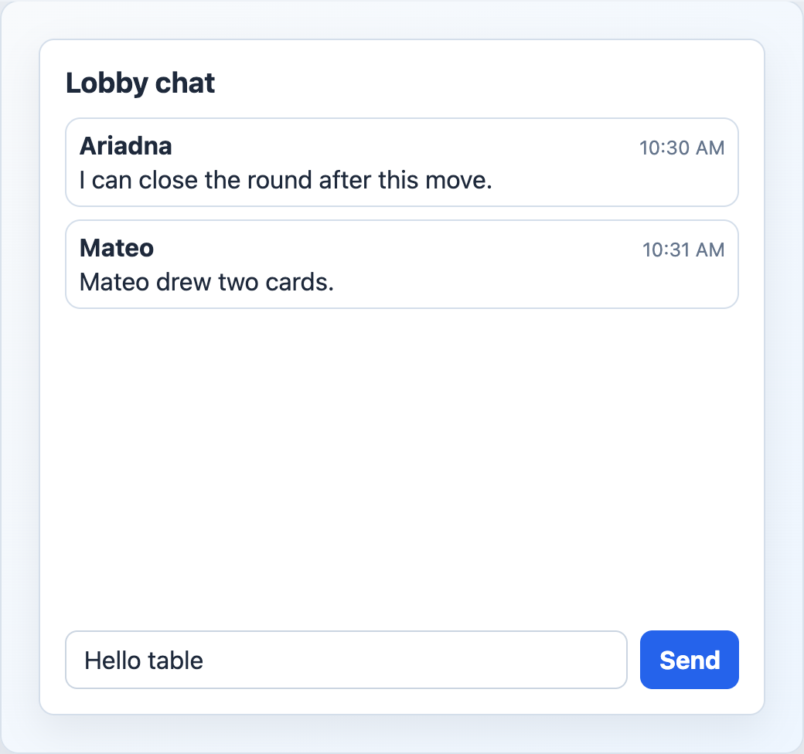

# EngineLobbyChat



## English

Lobby chat panel that combines `EngineChatMessages` and `EngineChatForm`.

### Props

| Prop | Type | Default |
| --- | --- | --- |
| `messages` | `ChatMessageView[]` | required |
| `draft` | `string` | required |
| `title` | `string` | `'Chat'` |
| `sendLabel` | `string` | `'Enviar'` |
| `disabled` | `boolean` | `false` |

### Events

| Event | Payload |
| --- | --- |
| `update:draft` | `string` |
| `send` | none |

### Slots

| Slot | Purpose |
| --- | --- |
| `actions` | Header actions. |
| `message` | Custom message body. Receives `{ message }`. |

```vue
<EngineLobbyChat
  v-model:draft="draft"
  :messages="messages"
  title="Lobby"
  @send="sendMessage"
/>
```

## Espanol

Panel de chat para lobby que combina `EngineChatMessages` y `EngineChatForm`.

## Screenshot Code / Codigo de la Captura

```vue
<script setup lang="ts">
import { ref } from 'vue'
import { EngineLobbyChat, installTurnEngineComponentStyles, type ChatMessageView } from '@javleds/vue-game-engine'

installTurnEngineComponentStyles()

const lobbyDraft = ref('Hello table')

const messages: ChatMessageView[] = [
  {
    id: 'm1',
    roomId: 'R-204',
    playerId: 'p1',
    nickname: 'Ariadna',
    kind: 'chat',
    message: 'I can close the round after this move.',
    createdAt: '2026-06-21T16:30:00Z',
  },
  {
    id: 'm2',
    roomId: 'R-204',
    playerId: 'p2',
    nickname: 'Mateo',
    kind: 'activity',
    message: 'Mateo drew two cards.',
    createdAt: '2026-06-21T16:31:00Z',
  },
]
</script>

<template>
  <section class="shot">
    <EngineLobbyChat
      v-model:draft="lobbyDraft"
      :messages="messages"
      title="Lobby chat"
      send-label="Send"
    />
  </section>
</template>

<style scoped>
.shot {
  width: 520px;
  min-height: 280px;
  padding: 24px;
  border-radius: 12px;
  background: #eef6ff;
}

:global(.te-lobby-chat) {
  border: 1px solid #d4deea;
  border-radius: 10px;
  background: white;
  padding: 16px;
  box-shadow: 0 10px 25px rgb(15 23 42 / 8%);
}

:global(.te-chat-message) {
  border: 1px solid #d4deea;
  border-radius: 10px;
  background: white;
}
</style>
```
