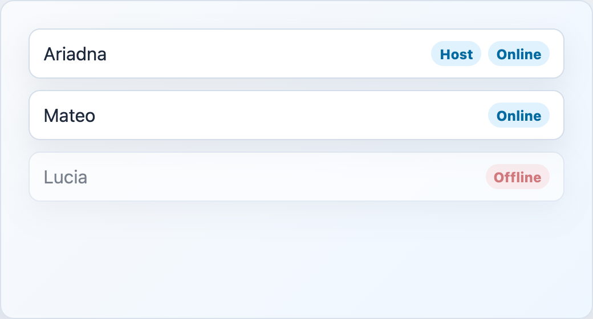

# EngineLobbyPlayerList



## English

Lobby player list with host and connection badges.

### Props

| Prop | Type | Default |
| --- | --- | --- |
| `players` | `LobbyPlayer[]` | required |
| `hostLabel` | `string` | `'Anfitrion'` |
| `connectedLabel` | `string` | `'En sala'` |
| `disconnectedLabel` | `string` | `'Sin conexion'` |

### Slots

| Slot | Purpose |
| --- | --- |
| `player` | Custom player name. Receives `{ player }`. |
| `badges` | Extra badges per player. Receives `{ player }`. |

```vue
<EngineLobbyPlayerList :players="room.players">
  <template #badges="{ player }">
    <span v-if="player.id === currentPlayerId">You</span>
  </template>
</EngineLobbyPlayerList>
```

## Espanol

Lista de jugadores del lobby con badges de anfitrion y conexion.

## Screenshot Code / Codigo de la Captura

```vue
<script setup lang="ts">
import { EngineLobbyPlayerList, installTurnEngineComponentStyles, type LobbyPlayer } from '@javleds/vue-game-engine'

installTurnEngineComponentStyles()

const players: LobbyPlayer[] = [
  { id: 'p1', nickname: 'Ariadna', is_host: true, connected: true },
  { id: 'p2', nickname: 'Mateo', is_host: false, connected: true },
  { id: 'p3', nickname: 'Lucia', is_host: false, connected: false },
]
</script>

<template>
  <section class="shot">
    <EngineLobbyPlayerList
      :players="players"
      connected-label="Online"
      disconnected-label="Offline"
      host-label="Host"
    />
  </section>
</template>

<style scoped>
.shot {
  width: 520px;
  min-height: 280px;
  padding: 24px;
  border-radius: 12px;
  background: #eef6ff;
}

:global(.te-player-list__item) {
  border: 1px solid #d4deea;
  border-radius: 10px;
  background: white;
  box-shadow: 0 10px 25px rgb(15 23 42 / 8%);
}

:global(.te-player-list__badge),
:global(.te-player-list__status) {
  border-radius: 999px;
  background: #e0f2fe;
  color: #0369a1;
  padding: 0.2rem 0.45rem;
}

:global(.te-player-list__status--offline) {
  background: #fee2e2;
  color: #b91c1c;
}
</style>
```
