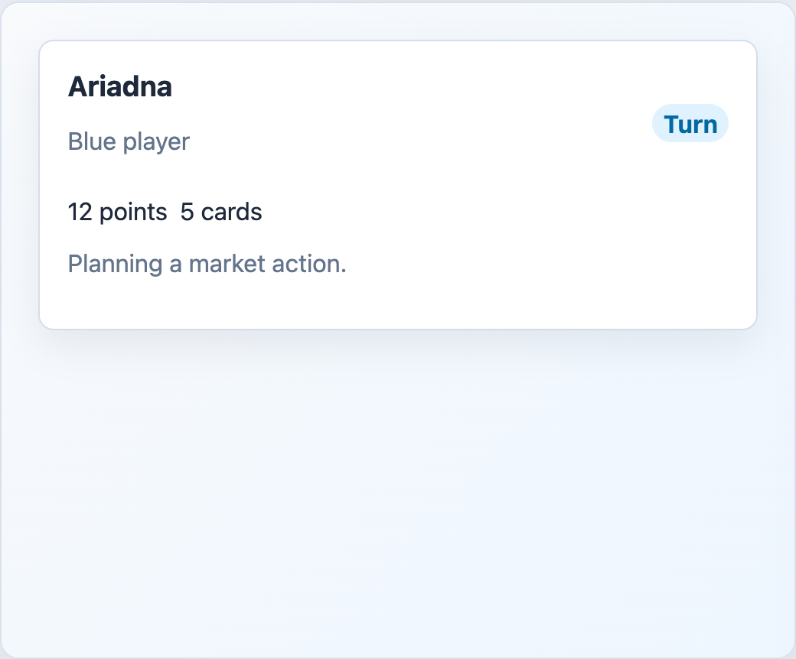

# EnginePlayerStatusPanel



## English

Player summary panel for sidebars, HUDs, or current-player status.

### Props

| Prop | Type | Default |
| --- | --- | --- |
| `title` | `string` | required |
| `subtitle` | `string` | `''` |
| `stats` | `EnginePlayerStat[]` | `[]` |
| `isCurrentTurn` | `boolean` | `false` |
| `currentTurnLabel` | `string` | `'Turno'` |

### Types

```ts
interface EnginePlayerStat {
  id: string
  label: string
}
```

### Slots

| Slot | Purpose |
| --- | --- |
| default | Main panel content. |
| `heading-actions` | Extra heading controls. |

```vue
<EnginePlayerStatusPanel
  title="Ariadna"
  subtitle="Blue player"
  :stats="[{ id: 'score', label: '12 points' }]"
  is-current-turn
/>
```

## Espanol

Panel de resumen de jugador para sidebars, HUDs o estado del jugador activo.

## Screenshot Code / Codigo de la Captura

```vue
<script setup lang="ts">
import { EnginePlayerStatusPanel, installTurnEngineComponentStyles } from '@javleds/vue-game-engine'

installTurnEngineComponentStyles()

const stats = [
  { id: 'score', label: '12 points' },
  { id: 'cards', label: '5 cards' },
]
</script>

<template>
  <section class="shot">
    <EnginePlayerStatusPanel
      title="Ariadna"
      subtitle="Blue player"
      :stats="stats"
      is-current-turn
      current-turn-label="Turn"
    >
      <p class="panel-note">Planning a market action.</p>
    </EnginePlayerStatusPanel>
  </section>
</template>

<style scoped>
.shot {
  width: 520px;
  min-height: 280px;
  padding: 24px;
  border-radius: 12px;
  background: #eef6ff;
}

:global(.te-player-status-panel) {
  border: 1px solid #d4deea;
  border-radius: 10px;
  background: white;
  padding: 18px;
  box-shadow: 0 10px 25px rgb(15 23 42 / 8%);
}

:global(.te-player-status-panel strong),
:global(.te-player-status-panel__stats span) {
  border-radius: 999px;
  background: #e0f2fe;
  color: #0369a1;
  padding: 0.2rem 0.45rem;
}

:global(.te-player-status-panel__stats) {
  gap: 8px;
  margin-top: 12px;
}

.panel-note {
  color: #64748b;
}
</style>
```
