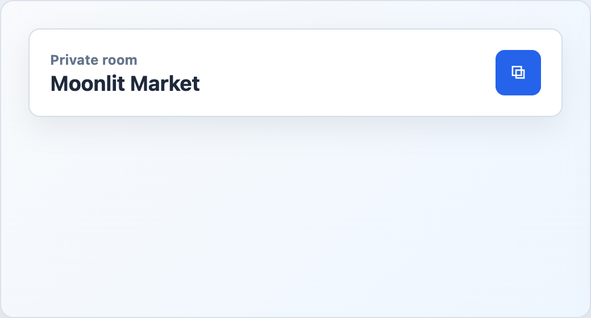

# EngineRoomSummary



## English

Compact room heading with optional resume-link action and extra host-defined actions.

### Props

| Prop | Type | Default |
| --- | --- | --- |
| `roomId` | `string` | required |
| `title` | `string` | `''` |
| `eyebrow` | `string` | `''` |
| `copyResumeLabel` | `string` | `'Copiar link para resumir partida'` |
| `canCopyResume` | `boolean` | `false` |

### Events

| Event | Payload |
| --- | --- |
| `copyResume` | none |

### Slots

| Slot | Purpose |
| --- | --- |
| `resumeIcon` | Replaces the default resume icon. |
| `actions` | Extra room actions. |

```vue
<EngineRoomSummary
  room-id="ABCD"
  title="Giants table"
  eyebrow="Private room"
  can-copy-resume
  @copy-resume="copyResumeLink"
/>
```

## Espanol

Encabezado compacto de sala con accion opcional para copiar link de reanudacion y acciones propias de la app host.

## Screenshot Code / Codigo de la Captura

```vue
<script setup lang="ts">
import { EngineRoomSummary, installTurnEngineComponentStyles } from '@javleds/vue-game-engine'

installTurnEngineComponentStyles()

function copyResumeLink(): void {
  console.log('Copy resume link')
}
</script>

<template>
  <section class="shot">
    <EngineRoomSummary
      room-id="R-204"
      title="Moonlit Market"
      eyebrow="Private room"
      can-copy-resume
      @copy-resume="copyResumeLink"
    />
  </section>
</template>

<style scoped>
.shot {
  width: 520px;
  min-height: 180px;
  padding: 24px;
  border-radius: 12px;
  background: #eef6ff;
}

:global(.te-room-summary) {
  border: 1px solid #d4deea;
  border-radius: 10px;
  background: white;
  padding: 18px;
  box-shadow: 0 10px 25px rgb(15 23 42 / 8%);
}

:global(.te-room-summary__eyebrow) {
  color: #64748b;
}

:global(.te-icon-button) {
  width: 40px;
  height: 40px;
  border: 0;
  border-radius: 8px;
  background: #2563eb;
  color: white;
}
</style>
```
