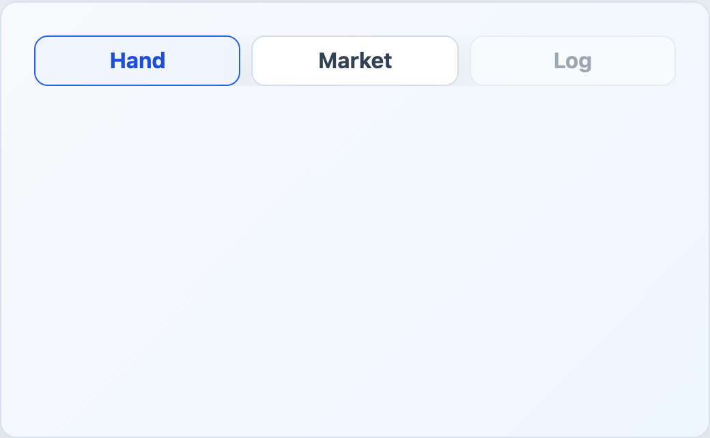

# EngineTabs



## English

Small controlled tab list for game panels.

### Props

| Prop | Type | Default |
| --- | --- | --- |
| `tabs` | `EngineTabOption[]` | required |
| `modelValue` | `string` | required |
| `tablistLabel` | `string` | required |

### Types

```ts
interface EngineTabOption {
  id: string
  label: string
  disabled?: boolean
}
```

### Events

| Event | Payload |
| --- | --- |
| `update:modelValue` | `string` |

```vue
<EngineTabs
  v-model="activePanel"
  tablist-label="Game panels"
  :tabs="[
    { id: 'hand', label: 'Hand' },
    { id: 'market', label: 'Market' },
    { id: 'log', label: 'Log', disabled: true },
  ]"
/>
```

## Espanol

Lista pequena y controlada de tabs para paneles del juego.

## Screenshot Code / Codigo de la Captura

```vue
<script setup lang="ts">
import { ref } from 'vue'
import { EngineTabs, installTurnEngineComponentStyles, type EngineTabOption } from '@javleds/vue-game-engine'

installTurnEngineComponentStyles()

const activeTab = ref('hand')
const tabs: EngineTabOption[] = [
  { id: 'hand', label: 'Hand' },
  { id: 'market', label: 'Market' },
  { id: 'log', label: 'Log', disabled: true },
]
</script>

<template>
  <section class="shot">
    <EngineTabs v-model="activeTab" :tabs="tabs" tablist-label="Game panels" />
  </section>
</template>

<style scoped>
.shot {
  width: 520px;
  min-height: 180px;
  padding: 24px;
  border-radius: 12px;
  background: #eef6ff;
}

:global(.te-tabs) {
  gap: 8px;
}

:global(.te-tabs__button) {
  border: 1px solid #d4deea;
  border-radius: 10px;
  background: white;
  color: #334155;
  padding: 0.55rem 0.75rem;
  box-shadow: 0 10px 25px rgb(15 23 42 / 8%);
}

:global(.te-tabs__button--active) {
  border-color: #2563eb;
  background: #eff6ff;
  color: #1d4ed8;
}
</style>
```
