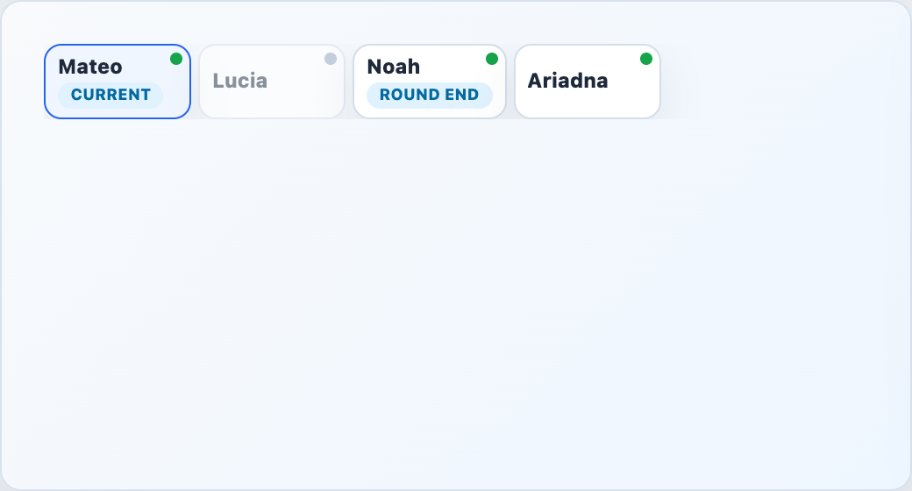

# EngineTurnOrder



## English

Horizontal turn order strip. It rotates the list from `currentPlayerId` and marks the current turn plus the round-ending player.

### Props

| Prop | Type | Default |
| --- | --- | --- |
| `players` | `EngineTurnPlayer[]` | required |
| `currentPlayerId` | `string \| null` | `null` |
| `roundEndPlayerId` | `string \| null` | `null` |
| `finalRoundTriggered` | `boolean` | `false` |
| `currentLabel` | `string` | `'Turno actual'` |
| `roundEndLabel` | `string` | `'Fin de ronda'` |
| `finalRoundEndLabel` | `string` | `'Fin de partida'` |
| `ariaLabel` | `string` | `'Orden de turnos desde el jugador actual'` |

### Types

```ts
interface EngineTurnPlayer {
  playerId: string
  nickname: string
  connected: boolean
}
```

### Slots

| Slot | Purpose |
| --- | --- |
| `player` | Custom player label. Receives `{ player }`. |
| `tags` | Extra tags. Receives `{ player, isCurrent, isRoundEnd }`. |

```vue
<EngineTurnOrder
  :players="players"
  current-player-id="player-2"
  round-end-player-id="player-4"
/>
```

## Espanol

Barra horizontal de orden de turnos. Rota la lista desde `currentPlayerId` y marca el turno actual y el jugador que cierra la ronda.

## Screenshot Code / Codigo de la Captura

```vue
<script setup lang="ts">
import { EngineTurnOrder, installTurnEngineComponentStyles, type EngineTurnPlayer } from '@javleds/vue-game-engine'

installTurnEngineComponentStyles()

const players: EngineTurnPlayer[] = [
  { playerId: 'p1', nickname: 'Ariadna', connected: true },
  { playerId: 'p2', nickname: 'Mateo', connected: true },
  { playerId: 'p3', nickname: 'Lucia', connected: false },
  { playerId: 'p4', nickname: 'Noah', connected: true },
]
</script>

<template>
  <section class="shot">
    <EngineTurnOrder
      :players="players"
      current-player-id="p2"
      round-end-player-id="p4"
      current-label="Current"
      round-end-label="Round end"
    />
  </section>
</template>

<style scoped>
.shot {
  width: 520px;
  min-height: 180px;
  padding: 24px;
  border-radius: 12px;
  background: #eef6ff;
}

:global(.te-turn-order__player) {
  border: 1px solid #d4deea;
  border-radius: 10px;
  background: white;
  box-shadow: 0 10px 25px rgb(15 23 42 / 8%);
}

:global(.te-turn-order__player--current) {
  border-color: #2563eb;
  background: #eff6ff;
}

:global(.te-turn-order__presence) {
  background: #94a3b8;
}

:global(.te-turn-order__presence--online) {
  background: #16a34a;
}

:global(.te-turn-order__tag) {
  border-radius: 999px;
  background: #e0f2fe;
  color: #0369a1;
  padding: 0.2rem 0.45rem;
}
</style>
```
